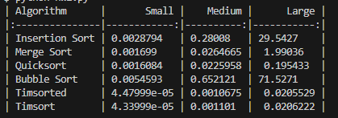

### Результати тесту

Timsort та Timsorted - найшвидші методи сортування в Python, особливо для великих обсягів даних. Bubble Sort та Insertion Sort неефективні для великих масивів. Merge Sort та Quicksort показують хороші результати на великих даних, але поступаються Timsort.

Висновок: Для великих масивів даних обирайте Timsort або алгоритми з лінійно-логарифмічним часом виконання (Merge Sort, Quicksort). Для невеликих масивів підійдуть Insertion Sort або Bubble Sort. Враховуйте, що Timsort - найкращий вибір для Python, тому немає сенсу писати власні алгоритми сортування.